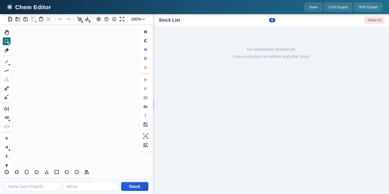

# Chem Editor

A lightweight compound structure editor powered by [Ketcher](https://github.com/epam/ketcher). Draw chemical structures, stock your ideas, and export them as CSV or SDF.



## Features

- Ketcher-based 2D structure drawing (preserves drawn coordinates)
- One-click compound stocking with name/memo
- Thumbnail grid with tooltip details and resizable panels
- CSV and SDF export (SDF retains 2D coordinates)
- Server-side SVG rendering and formula/MW calculation via RDKit
- Persistent JSON storage

## Quick Start

```bash
# Install Python dependencies
uv sync

# Build the Ketcher frontend (first time only)
cd ketcher-app && npm install && npm run build && cd ..

# Run
uv run python main.py
# → http://127.0.0.1:8000
```

## Tech Stack

| Component | License |
|-----------|---------|
| [Ketcher](https://github.com/epam/ketcher) | Apache-2.0 |
| [FastAPI](https://fastapi.tiangolo.com/) | MIT |
| [RDKit](https://www.rdkit.org/) | BSD-3-Clause |
| [uvicorn](https://www.uvicorn.org/) | BSD-3-Clause |
